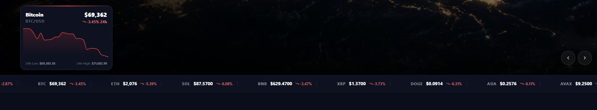

# Software Engineer Technical Assessment

## How to Run

```
git clone https://github.com/PumaPulse-Inc/Tradex-test-project.git
cd backend && npm install && npm start
cd ../frontend && npm install && npm run dev
```

Open [http://localhost:8080](http://localhost:8080)

---

## Live Market Widget Task

### Overview

Technical assessment for software engineers. Build a live market ticker bar on the dashboard from scratch using the existing Express backend and React frontend.

---

## Objective

Implement a scrolling ticker bar with live prices, a backend proxy for all external API calls, auto-refresh every 30 seconds, and a hover chart popup — all built from scratch.



---

## Requirements

### 1. Ticker Bar (Frontend)

Scrolling top bar on the dashboard showing live price + 24h % change for:
- **Crypto:** BTC, ETH, SOL, BNB, XRP 
- **Traditional:** S&P 500, Gold, EUR/USD 
### 2. Backend Proxy

New UI elements shall not inquire 3rd-party APIs directly

### 3. Auto Refresh

Prices update every 30 seconds via polling. Bonus: use WebSocket.

### 4. Hover Chart

Hovering a coin in the ticker shows a popup with its 24h price chart.

---

## Evaluation

| Area | Weight |
|------|--------|
| Code Quality & Architecture | 30% |
| Feature Implementation | 30% |
| Performance | 20% |
| User Experience | 10% |
| Unit Testing | 10% |

---

## Submission

Create branch `feature/market-widget` and submit a pull request with implementation summary.

> ⚠️ **Do not use Cursor, Copilot, or any other AI coding tools.** We evaluate your own problem-solving and code quality.

**Live Preview:** [https://tradex.pumapulse.org](https://tradex.pumapulse.org)

---

## Success Criteria

Deliver a production-quality market widget that demonstrates senior-level skills in architecture, performance optimization, and user experience design.

---

_Maintained by [PumaPulse](https://pumapulse.org)_
